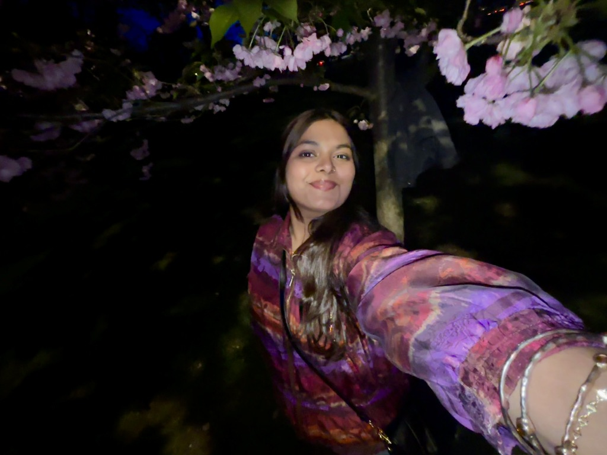

# Tuba Siddiqui

**Hi, I’m Tuba!**  
> Pronouns: She/Her

I’m passionate about exploring technological tools and leveraging them to create real-world solutions for environmental and human-centered challenges.  
I’m currently learning **Machine Learning**, **AI-driven data analysis**, and **Web Development**.  
I’m looking to collaborate on innovative solutions for **environment-based catastrophes**, **creative applications of machine-based resources**, and **community-driven tech initiatives**.

---

## 📬 How to Reach Me

- 📧 tubaashmeera@gmail.com  
- 🔗 [LinkedIn](https://www.linkedin.com/in/-tubasiddiqui)  
- 📱 (857) 423-5753  

---

## 👩‍🎓 About Me

### 🎓 Education

**Simmons University**, Boston, MA  
*Undergraduate | Sep 2023 – May 2027*  
**Major:** Computer Science  
**Minors:** Mathematics, Data Science, Biostatistics  
**Activities:** Strong Women Strong Girls, Simmons Model United Nations, Asian Students Association  

**City Montessori School**, Lucknow, India  
*High School Junior & Senior Year | Aug 2021 – May 2023*  
**Activities:** CMS MUN, CMS Arts Club, STEM Club for Inventors  

**City Montessori Inter College**, Lucknow, India  
*High School Freshman & Sophomore Year | Mar 2011 – Sep 2021*  
**Activities:** Swimming Club, Assembly Choir, Creative Thinker’s Club  

---

## 💻 Skills

- **Computer Tools:** Microsoft Office Suite, BlueJ, Visual Studio Code, Jupyter Notebook, GitHub  
- **Hardware:** Desktops, Printers, 3D Printers  
- **Languages:** Java, Python, C++, HTML, R  

---

## 📄 Resume

[📄 View My Resume (PDF)](TubaS_Resume.pdf)

---

> 🌸 *Currently, I am a member of Simmons University's Model United Nations Club and a mentor at Simmons University's Strong Women Strong Girls chapter. I also love volunteering at non-profit organizations like Rosie's Place.*

## 🚀 Projects
🎵 The Beatles & Data Visualization — STAT228 Mini-Project
Date: March 2025
Analyzed The Beatles’ music using R and ggplot2 to explore patterns in danceability, energy, and mood across albums.

- Created clean, easy-to-read plots  
- Wrote a blog-style report in R Markdown  
- Focused on clear visuals and simple storytelling with data  

🔗 [View Blog Post (HTML)](https://binarytown.github.io/my_portfolio/The-Beatles.html)  
📁 Project for Intro to Data Science, Simmons University